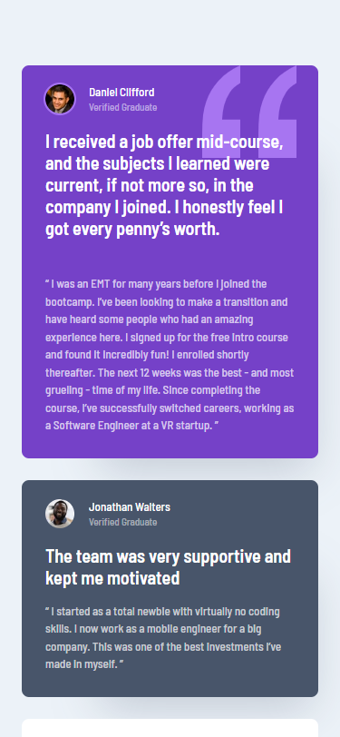
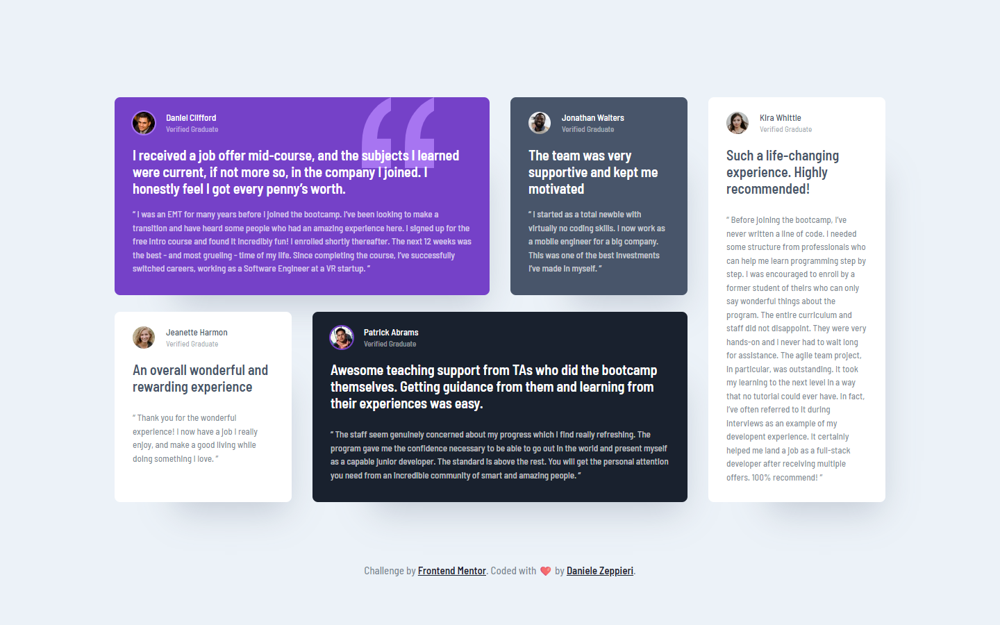

# Frontend Mentor - Testimonials grid section solution

This is a solution to the [Testimonials grid section challenge on Frontend Mentor](https://www.frontendmentor.io/challenges/testimonials-grid-section-Nnw6J7Un7). Frontend Mentor challenges help you improve your coding skills by building realistic projects.

## Table of contents

- [Overview](#overview)
  - [The challenge](#the-challenge)
  - [Screenshot](#screenshot)
  - [Links](#links)
- [My process](#my-process)
  - [Built with](#built-with)
  - [What I learned](#what-i-learned)
  - [Continued development](#continued-development)
- [Author](#author)

## Overview

### The challenge

Users should be able to:

- View the optimal layout for the site depending on their device's screen size

### Screenshot

### Mobile Version

### Desktop Version

### Links

- Solution URL: [Frontend Mentor](https://your-solution-url.com)
- Live Site URL: [Live Demo](https://dz-testimonial-grid-section.vercel.app/)

## My process

### Built with

- Semantic HTML5 markup
- CSS custom properties
- Flexbox
- CSS Grid
- Mobile-first workflow
- BEM

### What I learned

With this challenge, I learned a lot about myself. It's important that I work based on my skills without trying to developing as a middle-level or senior developer, this is only time-wasting and It makes me feel frustrated and lose confidence in myself. All experience for the next projects.

About the Challenge I renforced my skill with `CSS Grid` e with `@container queries`.

### Continued development
For the future, I would keep focus on how to work with `CSS Grid`, `Flexbox`, `Fluid typography`, `Fluid spacing` and `@properties`.

## Author

- Frontend Mentor - [@dedo-dev](https://www.frontendmentor.io/profile/dedo-dev)
- Linkedin - [@daniele-zeppieri](https://www.linkedin.com/in/daniele-zeppieri-0b1a36252/)